<div align="center">

# 🔐 VaultX

**Your files. Only you can open them.**

[](LICENSE)
[](https://developer.android.com/about/versions/oreo)
[](https://kotlinlang.org)

*Open source · Zero permissions · Fully local · No network*

**[中文文档](README.zh-CN.md)**

</div>

---

VaultX is a local-only encrypted vault for Android. Images, videos, audio, arbitrary files, and whole folder trees are encrypted on import and become invisible to the gallery, file managers, and every other app on the device. No accounts, no network permission, no root, no cloud — everything lives in the app's private storage, encrypted with keys derived from your password.

<table>
  <tr>
    <td>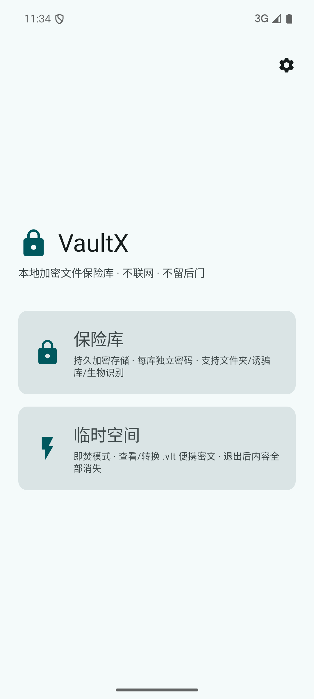</td>
    <td>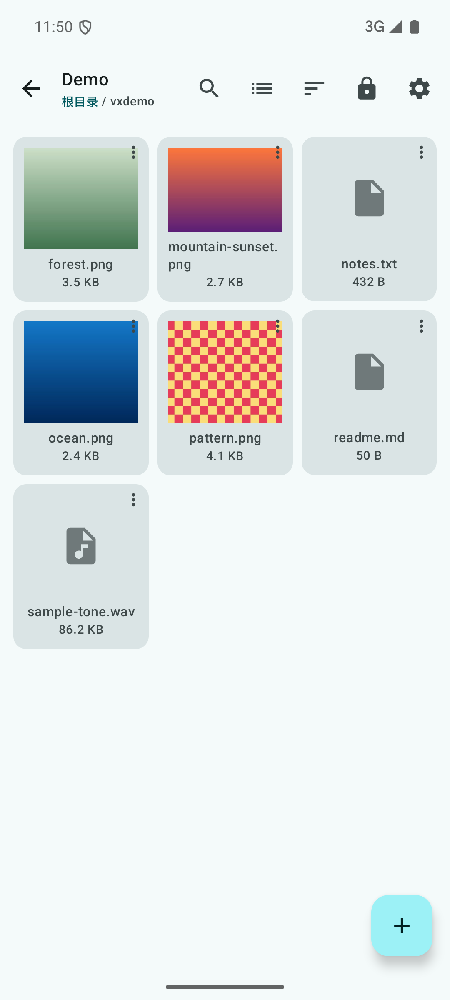</td>
    <td>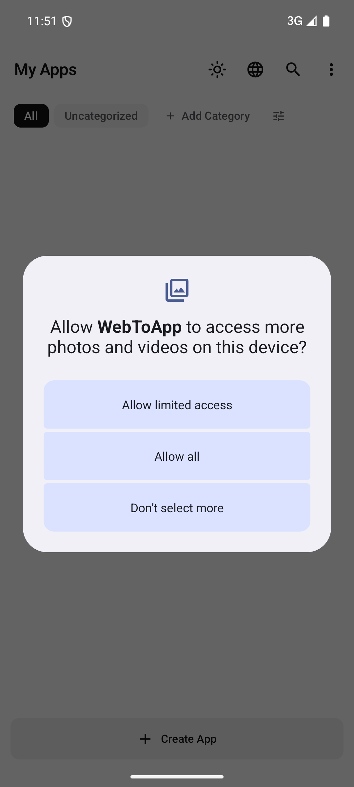</td>
    <td>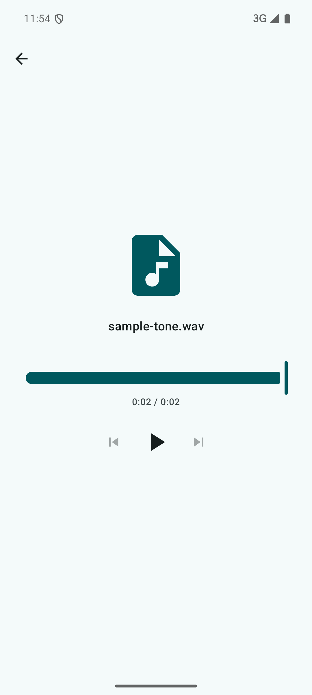</td>
  </tr>
  <tr>
    <td align="center"><sub>Mode selection</sub></td>
    <td align="center"><sub>Encrypted thumbnails</sub></td>
    <td align="center"><sub>Image viewer</sub></td>
    <td align="center"><sub>Audio player</sub></td>
  </tr>
</table>

## ✨ Features

### 🔒 Locked mode — persistent encrypted vaults
- **Multi-vault**: create independent vaults, each with its own password
- **Five entry kinds**: images / videos / audio / files / folders
- **Invisible once imported**: files vanish from the system gallery and file managers
- **Grid & list views**: view and sort preferences persist; search hits across folders show their location
- **Media preview**: paged image viewer with double-tap/pinch zoom, same-folder playlists for video & audio, inline text preview (UTF-8/GBK)
- **File operations**: import (including whole directory trees) / rename / move / duplicate (recursive folder copy) / delete / export — decrypted, or encrypted as `.vlt`
- **`.vlt` two-way interop**: export any entry as a portable ciphertext with a one-time password; importing a `.vlt` asks for its password and streams plaintext straight into a new encrypted blob — it never touches disk
- **Undoable delete**: deletions sit in an 8-second undo window before ciphertext is erased; any new operation finalizes the previous batch
- **Drag & drop move**: drag selections onto folder cells; multi-select with count, select-all, batch export
- **Duplicate-import skip**: same name + same size is detected, no `(2)` copies
- **Password change with zero re-encryption**: key-wrapping means re-locking the same master key under a new password is instant
- **Biometric unlock (opt-in)**: fingerprint/face instead of password. The master key is wrapped by a non-exportable Android Keystore key that requires live authentication every unlock; the password always remains the fallback
- **Decoy vault (opt-in)**: one vault, two passwords. The real password opens the real vault; the decoy password opens a visually identical independent vault — indistinguishable, for coerced-disclosure scenarios
- **`.fvault` vault backup**: ciphertext-level archive export (no password needed, per-file SHA-256; streaming verification on import with progress)
- **Master gate switch**: controls whether opening a vault requires its password (encrypts the index at rest)
- **Emergency wipe**: destroy all vaults in one tap (type-to-confirm)

### 🌀 Lock-free mode — session space
- **Burn-on-exit**: all files are destroyed on exit or restart; import loose files or whole folders (flattened, name collisions resolved)
- **Encrypted conversion**: produce `.vlt` portable ciphertexts with a one-time password
- **Temporary decryption**: open `.vlt` files for in-session preview — closing burns them

### 🛡️ Protection
- **FLAG_SECURE**: blocks screenshots/recents preview (configurable)
- **Auto-lock**: timer fires while backgrounded — keys are wiped even if you never return
- **Lock = wipe**: VMK zeroized and decrypted index dropped from the heap
- **No backup leaks**: `allowBackup=false`

---

## 🔐 Encryption architecture

```
password ──Argon2id (memory-hard KDF)──▶ KEK
                                          │
                          AES-256-GCM wrap ▼
                                        VMK (random master key)
                                          │
              Tink Streaming AEAD (AES-256-GCM-HKDF, 4KB segments)
                                          │
                        file encryption (seekable, stream-decrypt)

decoy password ──Argon2id (independent salt)──▶ decoy KEK ──wraps──▶ decoy VMK ──▶ decoy index
(the two passwords of one vault run fully independent key chains — failures look identical)
```

**Key design points**:
- **VMK is randomly generated** — never derived from the password directly
- **Password verification IS the unwrap** — no separate checkable digest to tamper with
- **Password change = re-wrap the same VMK** under a new KEK — zero re-encryption, instant
- **Open-source security**: with full source and all ciphertext, nothing decrypts without the password

See [SECURITY.md](SECURITY.md) for the full, honest threat model — including what VaultX does **not** protect against.

---

## 📸 Screenshots

<table>
  <tr>
    <td>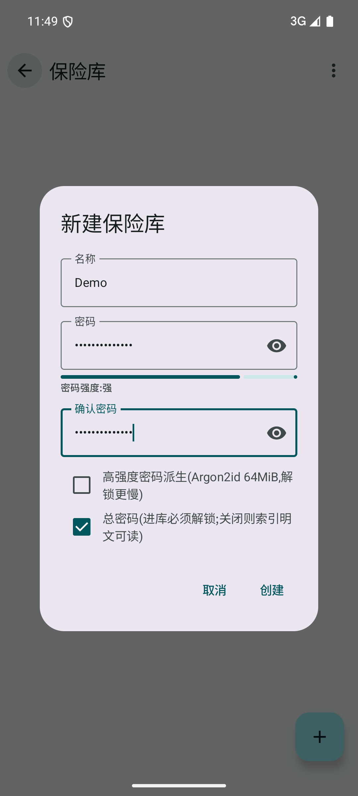</td>
    <td>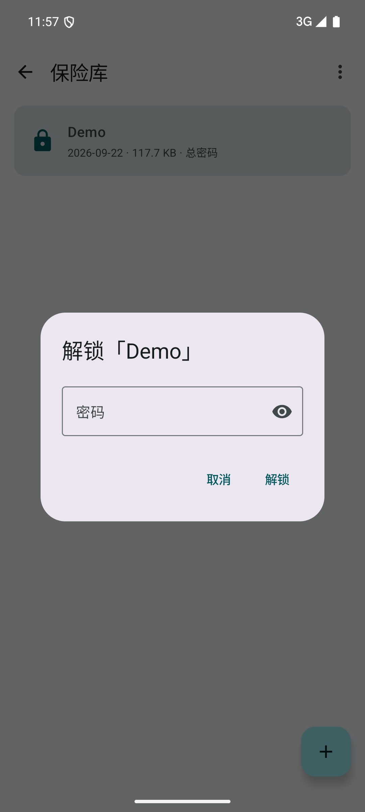</td>
    <td>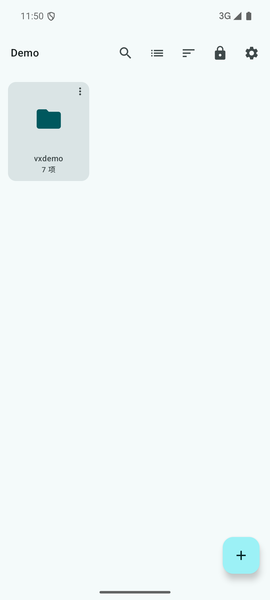</td>
    <td>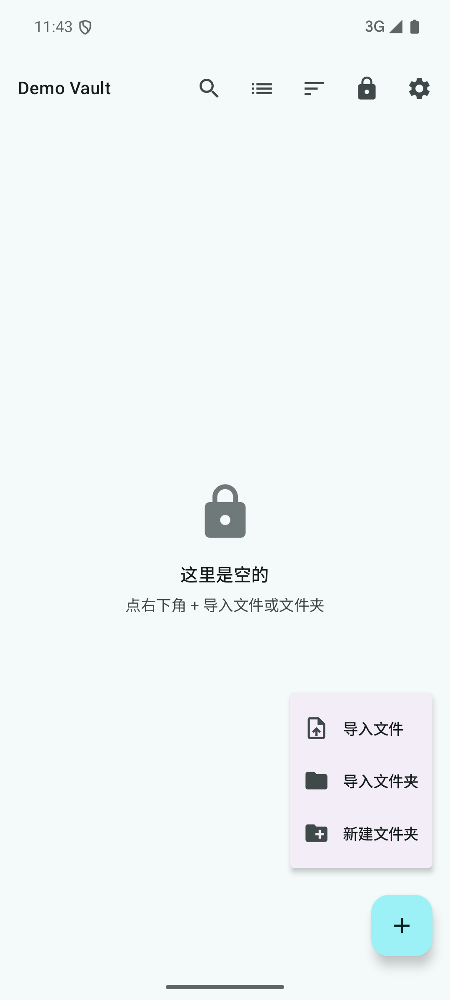</td>
  </tr>
  <tr>
    <td align="center"><sub>New vault · strength meter</sub></td>
    <td align="center"><sub>Unlock</sub></td>
    <td align="center"><sub>Vault root</sub></td>
    <td align="center"><sub>Import menu</sub></td>
  </tr>
  <tr>
    <td>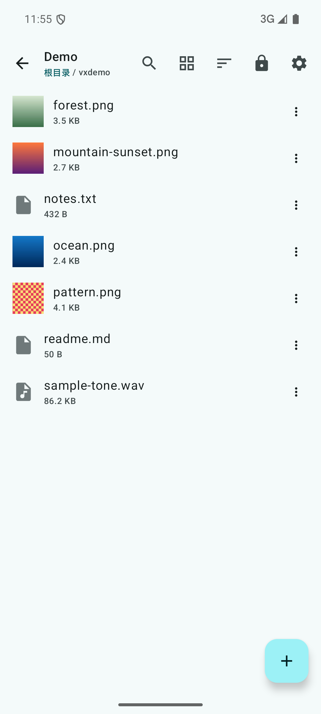</td>
    <td>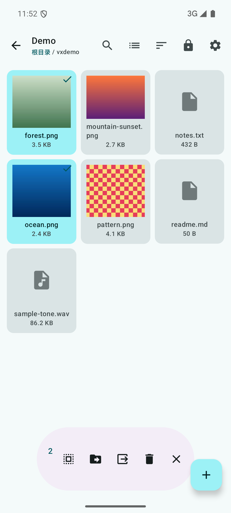</td>
    <td>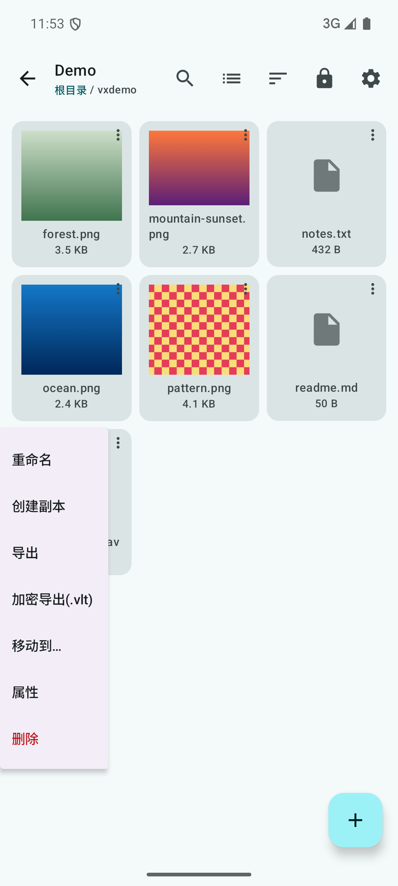</td>
    <td>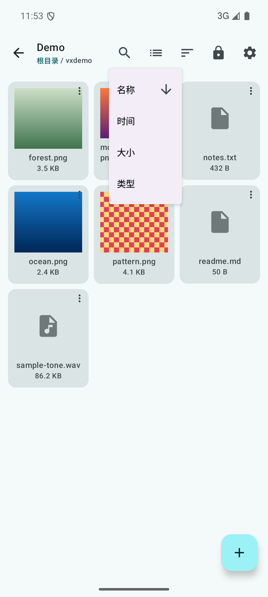</td>
  </tr>
  <tr>
    <td align="center"><sub>List view</sub></td>
    <td align="center"><sub>Multi-select</sub></td>
    <td align="center"><sub>Entry operations</sub></td>
    <td align="center"><sub>Sorting</sub></td>
  </tr>
  <tr>
    <td>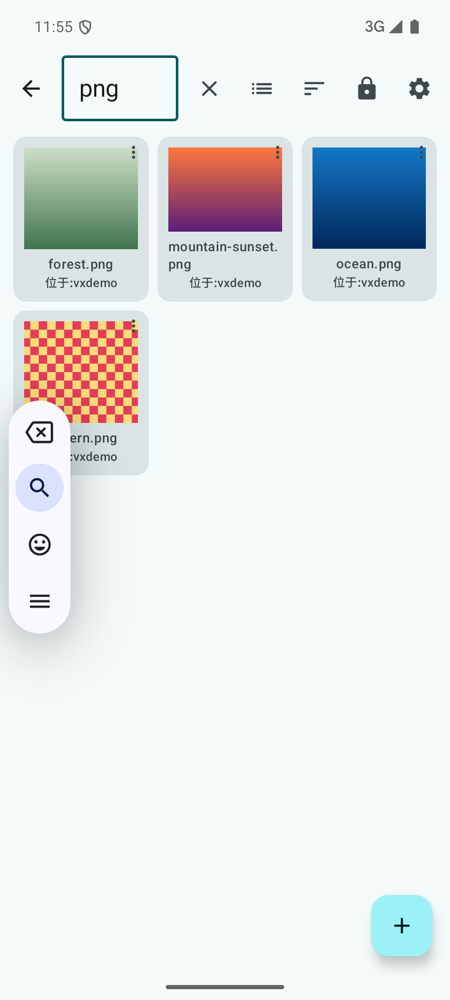</td>
    <td>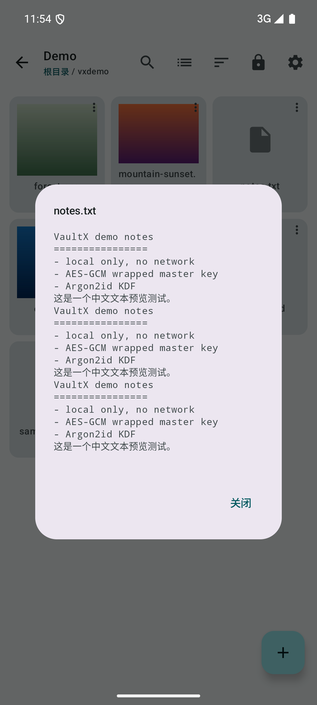</td>
    <td>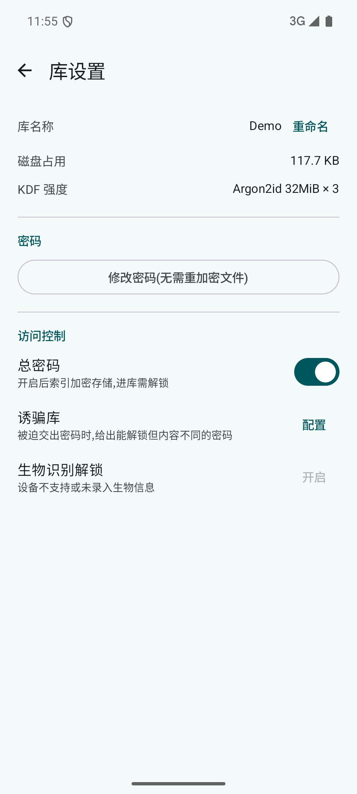</td>
    <td>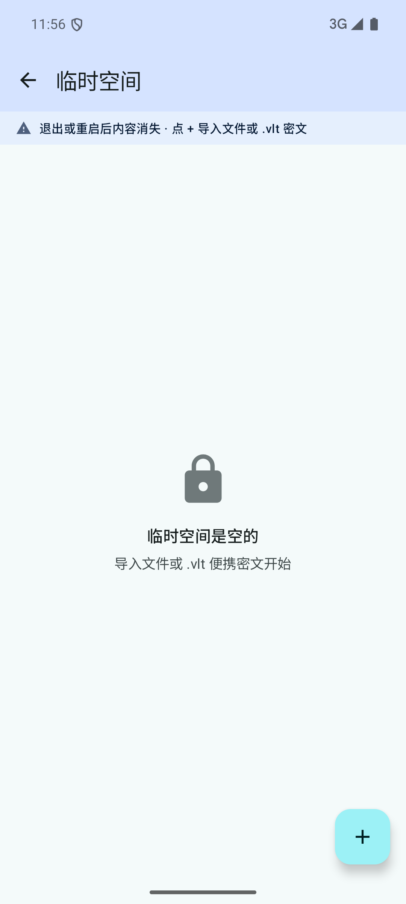</td>
  </tr>
  <tr>
    <td align="center"><sub>Cross-folder search</sub></td>
    <td align="center"><sub>Text preview</sub></td>
    <td align="center"><sub>Vault settings</sub></td>
    <td align="center"><sub>Session space</sub></td>
  </tr>
</table>

---

## 🏗️ Tech stack

| Layer | Technology |
|-------|-----------|
| UI | Kotlin + Jetpack Compose + Material 3 Expressive |
| Navigation | Navigation 3 |
| KDF | Argon2id (BouncyCastle) |
| File encryption | Google Tink Streaming AEAD |
| Image loading | Coil 3 (custom decrypting fetcher) |
| Audio/Video | Media3 ExoPlayer (custom decrypting DataSource) |
| Thumbnails | MediaMetadataRetriever |
| Storage | DataStore Preferences (settings) + private internal storage (ciphertext) |
| Import/Export | Storage Access Framework (SAF) |

---

## 🚀 Build

### Requirements
- Android Studio Hedgehog+ or `sdkmanager` CLI
- JDK 17+
- Android SDK 36 (compileSdk 37)

### Steps

```bash
git clone https://github.com/shiaho777/vaultx.git
cd vaultx

# Debug APK
./gradlew :app:assembleDebug

# Unit tests
./gradlew :app:testDebugUnitTest

# Install
adb install app/build/outputs/apk/debug/app-debug.apk
```

Release builds are unsigned by default; sign with your own keystore via `assembleRelease`.

---

## 📁 Project layout

```
app/src/main/java/io/vaultx/app/
├── core/
│   ├── crypto/          # Argon2idKdf · KeyWrap · TinkStreaming · VaultCrypto · PortableCipher
│   ├── security/        # BiometricKeystore (Keystore key for biometric unlock)
│   ├── vault/           # VaultManager · VaultArchive (.fvault) · VaultMeta · VaultIndex
│   ├── transfer/        # TransferEngine (import/export) · SafTransfer (SAF adapter)
│   ├── media/           # Thumbnailer · VaultImageFetcher · VaultDataSource
│   ├── session/         # SessionManager (burn-on-exit space, .vlt conversion)
│   └── state/           # VaultSessionHolder (key holder, auto-lock) · AppSettings
├── ui/
│   ├── mode/            # Mode selection
│   ├── vault/           # Vault list / home / settings / unlock gate
│   ├── viewer/          # Image viewer / video & audio players
│   ├── session/         # Session-mode UI
│   ├── settings/        # App settings
│   ├── components/      # Shared widgets (incl. biometric unlock facade)
│   ├── nav/             # Navigation
│   └── theme/           # M3 Expressive theme
├── MainActivity.kt
└── VaultXApp.kt         # Application + Coil registration
```

---

## 📖 Security notes

Read [SECURITY.md](SECURITY.md) for the complete threat model and honest disclosures.

**Core facts**:
- No password recovery
- Lost password = lost data
- No root protection = no root capability required either
- Open source = public auditability

---

## 📜 License

[GNU General Public License v3.0](LICENSE).

GPL is the established convention for privacy tools (GnuPG, KeePassXC, Cryptomator) — it keeps the code open and free, forever.

---

## 🤝 Contributing

Contributions, bug reports, and suggestions are welcome.

1. Fork the repository
2. Create a feature branch (`git checkout -b feature/amazing-feature`)
3. Commit your changes (`git commit -m 'Add amazing feature'`)
4. Push (`git push origin feature/amazing-feature`)
5. Open a Pull Request

---

<div align="center">

**VaultX** — privacy protection within reach

</div>
